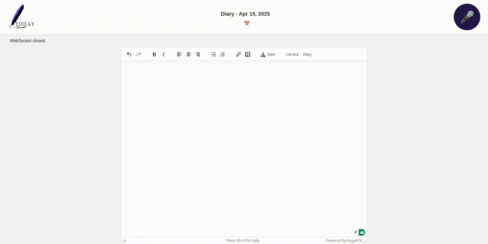

# TODAY

Today is a FastAPI-based application that enables users to transcribe and store their diary entries through an online speech-to-text system. 



## Features
- **Speech-to-Text Transcription**: Uses Whisper ASR for converting spoken words into text.
- **Real-time Processing**: Utilizes WebSocket connections to process audio streams in real time.
- **Diary Saving & Retrieval**: Stores diary entries with timestamps and enables users to retrieve past entries.
- **Grammar Correction**: Uses an LLM to correct grammatical mistakes in diary entries you can use any open source LLM you like.
- **privacy**: completly private to you `No APIs used`

## Technologies Used
- **Whisper ASR**: Automatic Speech Recognition model for transcriptions.
- **VLLM**: Integration for LLM-based text processing.
- **FastAPI**: API framework for building scalable applications.
- **WebSockets**: For real-time communication with the transcription backend.

## Installation
### Prerequisites
Ensure you have the following installed:
- Python 3.12
- FFmpeg
- Whisper ASR dependencies
- Hugging Face API Token (for LLM access)
- cudnn
- Docker and Docker Compose (for containerized setup)

### Setup
#### Option 1: Docker Installation (Recommended)
1. Make sure you have **Docker** and **Docker Compose** installed
2. clone the repo 
```shell
git clone https://github.com/Mahmoud-ghareeb/today.git
```
3. Create a `.env` file with your Hugging Face token:
```shell
cp .env.example .env
```
4. Add your HF token to the **.env** file
5. Build and run the container:
```shell
docker compose up --build -d
```
6. The application will automatically start when you run `docker-compose up`. Access it at:
- Web Interface: http://localhost:8008


#### Option 2: Local Installation
1. create conda env
```shell
conda create -n today python==3.12
conda activate today
```
2. install pytorch
```
pip3 install torch torchvision torchaudio --index-url https://download.pytorch.org/whl/cu126
```
3. install dependencies
```
sudo apt install portaudio19-dev && python3-pyaudio
```
4. install the requirements
```shell
pip install -r requirements.txt
```
5. install cudnn

6. Set up environment variables:
make a copy of `.env.example` file rename it to `.env` and fill the required information

7. To start the FastAPI server:
```shell
python main.py
```

## API Endpoints
### WebSocket Endpoint
- `/asr`: Accepts audio streams and transcribes them in real time.

### REST Endpoints
- `GET /`: Serves the static HTML interface.
- `POST /save`: Saves a diary entry.
- `GET /get`: Retrieves a diary entry by timestamp.
- `POST /diary`: Converts raw transcription into a diary format.
- `POST /correct_mistakes`: Corrects grammatical mistakes in the text.

## Usage
1. Open the application interface in a browser.
2. Start speaking, and the app will transcribe in real time.
3. Save the transcribed text as a diary entry.
4. Retrieve and edit past entries as needed.
5. Use the AI-powered grammar correction and diary formatting features.

## Under Development
- [x] Correct Mistakes
- [x] Diary Formatting
- [x] Docker Support

## Todos
- [ ] Dark mode
- [ ] Chat feature

## Future Enhancements
- Support for multiple languages.

## Contributions
Contributions are welcome! Feel free to open an issue or submit a pull request.

## Contact
For any questions or support, reach out to `mahmoudghareeb11111@gmail.com`. 